# Architecture Diagram Prompt for Multi-Tenant SaaS Application

## Prompt for Diagram Generation Tools (Mermaid, Draw.io, Lucidchart, etc.)

---

## Complete Architecture Visualization Prompt

Create a comprehensive architecture diagram for a **Multi-Tenant SaaS Application** deployed on AWS with the following components and communication flows:

---

## LAYOUT STRUCTURE

### Layer 1: User Interface Layer (Top)
Position three CloudFront distributions horizontally across the top:

1. **Admin UI CloudFront** (d2kr9nht29ell2.cloudfront.net)
   - Serves Admin Management Interface
   - Connected to Admin S3 Bucket below it

2. **Landing UI CloudFront** (d1anzfh5z8er19.cloudfront.net)
   - Serves Tenant Registration Page
   - Connected to Landing S3 Bucket below it

3. **Application UI CloudFront** (d205pzi1iv7uca.cloudfront.net)
   - Serves Tenant Application Interface
   - Connected to Application S3 Bucket below it

### Layer 2: Storage Layer
Three S3 buckets directly below their CloudFront distributions:
- **Admin S3 Bucket** (Angular Admin App)
- **Landing S3 Bucket** (Angular Landing App)  
- **Application S3 Bucket** (Angular Application App)

### Layer 3: API Gateway Layer
Two API Gateway REST APIs positioned horizontally:

1. **Admin API Gateway** (3f0tmsxor5.execute-api.ap-south-1.amazonaws.com)
   - Stage: prod
   - Label: "Control Plane API"
   - Show endpoints: /tenant, /tenants, /registration, /user, /users

2. **Tenant API Gateway** (9ajkik3ree.execute-api.ap-south-1.amazonaws.com)
   - Stage: prod
   - Label: "Application Plane API"
   - Show endpoints: /products, /product/{id}, /orders, /order/{id}

### Layer 4: Authorization Layer
Two Lambda Authorizer functions:

1. **SharedServicesAuthorizer**
   - Attached to Admin API Gateway
   - Validates JWT tokens from both user pools

2. **BusinessServicesAuthorizer** (Tenant Authorizer)
   - Attached to Tenant API Gateway
   - Validates tenant JWT, injects tenantId to context

### Layer 5: Authentication Layer
Two Cognito User Pools positioned horizontally:

1. **Admin User Pool** (ap-south-1_VU89mDTLJ)
   - App Client: 6jk45rug890kk89jfobehrj69f
   - Stores: System Admins, SaaS Operators
   - Custom attributes: userRole, tenantId

2. **Tenant User Pool** (ap-south-1_jFVOFdJoQ)
   - App Client: 407he6r8lt9uijknaifaih6chb
   - Stores: Tenant Admins, End Users
   - Custom attributes: userRole, tenantId

### Layer 6: Business Logic Layer
Two groups of Lambda functions:

**Left Group - Control Plane Functions (15 Functions)**:
- Tenant Management: RegisterTenant, CreateTenant, GetTenants, GetTenant, UpdateTenant, ActivateTenant, DeactivateTenant
- User Management: CreateTenantAdminUser, CreateUser, GetUsers, GetUser, UpdateUser, DisableUser

**Right Group - Application Plane Functions (12 Functions)**:
- Product Service: CreateProduct, GetProducts, GetProduct, UpdateProduct, DeleteProduct
- Order Service: CreateOrder, GetOrders, GetOrder, UpdateOrder, DeleteOrder

### Layer 7: Data Layer (Bottom)
Four DynamoDB tables positioned horizontally:

**Control Plane Tables**:
1. **TenantDetails** (demo-saas-TenantDetails)
   - PK: tenantId
   - Stores: tenant metadata, configuration

2. **TenantUserMapping** (demo-saas-TenantUserMapping)
   - PK: tenantId, SK: userName
   - Stores: user-to-tenant mappings

**Application Plane Tables**:
3. **Product-pooled** (demo-saas-Product-pooled)
   - PK: shardId (contains tenantId), SK: productId
   - Stores: products for all tenants

4. **Order-pooled** (demo-saas-Order-pooled)
   - PK: shardId (contains tenantId), SK: orderId
   - Stores: orders for all tenants

### Supporting Components (Side Panel or Bottom)
- **Lambda Layer**: serverless-saas-dependencies (shared utilities)
- **SAM S3 Bucket**: demo-saas-sam-artifacts-f94db367 (deployment artifacts)
- **CloudWatch**: 27 Log Groups for Lambda functions
- **IAM Roles**: 8 execution roles for Lambda functions

---

## COMMUNICATION FLOWS

### Flow 1: Tenant Self-Registration (Landing UI → Admin API)
**Steps**:
1. User opens Landing UI (https://d1anzfh5z8er19.cloudfront.net)
2. CloudFront serves static files from Landing S3 Bucket
3. User fills registration form (tenantName, email, etc.)
4. Angular app sends POST request to Admin API: `/registration`
5. API Gateway routes to RegisterTenantFunction Lambda
6. RegisterTenantFunction:
   - Calls CreateTenantFunction (stores in TenantDetails table)
   - Calls CreateTenantAdminUserFunction (creates user in Tenant User Pool)
   - Returns success with tenant credentials
7. User receives email with temporary password

**Visual Elements**:
- Solid arrow: Landing UI → Admin API Gateway → RegisterTenantFunction
- Dotted arrow: RegisterTenantFunction → TenantDetails table
- Dotted arrow: RegisterTenantFunction → Tenant User Pool
- Color: Green for success path

### Flow 2: Admin Login & Tenant Management (Admin UI → Admin API)
**Steps**:
1. Admin opens Admin UI (https://d2kr9nht29ell2.cloudfront.net)
2. CloudFront serves Angular app from Admin S3 Bucket
3. Admin enters credentials (email/password)
4. Angular app authenticates with Admin User Pool (Cognito)
5. Cognito returns JWT token with custom:userRole="SystemAdmin"
6. Admin clicks "View Tenants"
7. Angular app sends GET request to Admin API: `/tenants` with JWT in Authorization header
8. API Gateway invokes SharedServicesAuthorizer
9. SharedServicesAuthorizer:
   - Validates JWT against Admin User Pool
   - Checks TenantDetails table for authorization
   - Returns IAM policy (allowAllMethods)
10. API Gateway forwards to GetTenantsFunction
11. GetTenantsFunction scans TenantDetails table
12. Returns list of all tenants to Admin UI

**Visual Elements**:
- Solid arrow: Admin UI → Cognito Admin Pool → Admin API
- Dashed arrow: SharedServicesAuthorizer → Admin User Pool (validation)
- Dashed arrow: SharedServicesAuthorizer → TenantDetails table (authorization check)
- Solid arrow: GetTenantsFunction → TenantDetails table (read)
- Color: Blue for authentication, Purple for data operations

### Flow 3: Tenant User Login (Application UI → Tenant User Pool)
**Steps**:
1. Tenant user opens Application UI (https://d205pzi1iv7uca.cloudfront.net)
2. CloudFront serves Angular app from Application S3 Bucket
3. User enters credentials (tenantId-based email/password)
4. Angular app authenticates with Tenant User Pool (Cognito)
5. Cognito validates credentials
6. Returns JWT token with custom:tenantId="4c5257b3..." and custom:userRole="TenantAdmin"
7. Application stores JWT in browser local storage

**Visual Elements**:
- Solid arrow: Application UI → Tenant User Pool
- Bidirectional arrow: Tenant User Pool ↔ Application UI (JWT exchange)
- Color: Orange for authentication flow

### Flow 4: Product Creation (Application UI → Tenant API)
**Steps**:
1. Logged-in tenant user clicks "Create Product"
2. User fills form (SKU, name, price, category)
3. Angular app sends POST request to Tenant API: `/product` with JWT token
4. API Gateway invokes BusinessServicesAuthorizer (Tenant Authorizer)
5. BusinessServicesAuthorizer:
   - Validates JWT against Tenant User Pool
   - Extracts tenantId from JWT claims
   - Adds tenantId to authorizer context: { tenantId: "4c5257b3...", userName: "admin@tenant.com" }
   - Returns IAM policy (allowAllMethods)
6. API Gateway forwards request to CreateProductFunction with context
7. CreateProductFunction:
   - Reads tenantId from event['requestContext']['authorizer']['tenantId']
   - Generates shardId = tenantId + "-" + randomSuffix
   - Creates product record with shardId as partition key
   - Writes to Product-pooled table
8. Returns success response with product details
9. Application UI updates product list

**Visual Elements**:
- Solid arrow: Application UI → Tenant API Gateway
- Dashed arrow: BusinessServicesAuthorizer → Tenant User Pool (JWT validation)
- Thick arrow: BusinessServicesAuthorizer → CreateProductFunction (context with tenantId)
- Solid arrow: CreateProductFunction → Product-pooled table (PutItem)
- Color: Green for successful creation

### Flow 5: Product Retrieval (Application UI → Tenant API)
**Steps**:
1. User navigates to "Products" page
2. Angular app sends GET request to Tenant API: `/products` with JWT
3. API Gateway invokes BusinessServicesAuthorizer (same validation as Flow 4)
4. API Gateway forwards to GetProductsFunction with tenantId in context
5. GetProductsFunction:
   - Reads tenantId from authorizer context
   - Queries Product-pooled table with shardId prefix = tenantId
   - Filters products belonging only to this tenant
6. Returns array of products
7. Application UI displays products in table/grid

**Visual Elements**:
- Solid arrow: Application UI → Tenant API → GetProductsFunction
- Solid arrow: GetProductsFunction → Product-pooled table (Query with tenantId filter)
- Return arrow: Product-pooled table → GetProductsFunction → Application UI
- Color: Blue for read operations

### Flow 6: Order Creation (Application UI → Tenant API)
**Steps**:
1. User clicks "Create Order"
2. Selects products and quantities
3. Angular app sends POST request to Tenant API: `/order` with JWT
4. API Gateway → BusinessServicesAuthorizer → CreateOrderFunction (same auth as products)
5. CreateOrderFunction:
   - Reads tenantId from context
   - Generates shardId = tenantId + "-" + randomSuffix
   - Creates order record with line items
   - Writes to Order-pooled table
6. Returns order confirmation

**Visual Elements**:
- Similar to Product Creation flow
- Solid arrow: CreateOrderFunction → Order-pooled table (PutItem)
- Color: Green for creation

### Flow 7: Cross-Service Data Flow (Complete Request Lifecycle)
**End-to-End Example: Admin Creates Tenant, Tenant Creates Product**:

1. **Admin creates tenant**:
   - Admin UI → Admin API → RegisterTenantFunction
   - RegisterTenantFunction → TenantDetails table (writes tenant record)
   - RegisterTenantFunction → Tenant User Pool (creates admin user)
   - RegisterTenantFunction → TenantUserMapping table (maps user to tenant)

2. **Tenant admin logs in**:
   - Application UI → Tenant User Pool (authentication)
   - Returns JWT with tenantId

3. **Tenant creates product**:
   - Application UI → Tenant API → BusinessServicesAuthorizer
   - BusinessServicesAuthorizer → Tenant User Pool (validates JWT)
   - API Gateway → CreateProductFunction (with tenantId in context)
   - CreateProductFunction → Product-pooled table (writes with shardId)

4. **Data isolation verification**:
   - GetProductsFunction queries Product-pooled with tenantId filter
   - Only returns products where shardId starts with current tenantId
   - Tenant A cannot see Tenant B's products

**Visual Elements**:
- Numbered sequence diagram showing complete lifecycle
- Different colors for each step: Admin operations (blue), Authentication (orange), Business logic (green)
- Highlight isolation: Show filter barrier on Product-pooled table preventing cross-tenant access

---

## DATA FLOW PATTERNS

### Pattern 1: Authentication Flow (Cognito → API Gateway → Lambda)
```
User Credentials → Cognito User Pool
                 ↓
            JWT Token (with tenantId)
                 ↓
         API Gateway Request (Authorization: Bearer <JWT>)
                 ↓
         Lambda Authorizer (validates JWT)
                 ↓
         IAM Policy (Allow/Deny) + Context (tenantId)
                 ↓
         Business Logic Lambda (receives tenantId from context)
```

### Pattern 2: Tenant Isolation Pattern
```
Multiple Tenants → Same DynamoDB Table (Product-pooled)
                 ↓
         Partition Key = shardId (contains tenantId)
                 ↓
         Query with shardId prefix filter
                 ↓
         Results filtered by tenantId automatically
```

### Pattern 3: Control Plane vs Application Plane
```
Control Plane (Shared Stack):
- Admin API Gateway → Tenant Management Functions → TenantDetails table
- Manages: Tenants, Users, Configuration

Application Plane (Tenant Stack):
- Tenant API Gateway → Business Functions → Product/Order tables
- Manages: Products, Orders, Business Data
```

---

## VISUAL STYLING SUGGESTIONS

### Color Scheme:
- **Admin UI & Admin API**: Blue (#2196F3)
- **Landing UI**: Yellow (#FFC107)
- **Application UI & Tenant API**: Green (#4CAF50)
- **Cognito User Pools**: Orange (#FF9800)
- **Lambda Functions**: Purple (#9C27B0)
- **DynamoDB Tables**: Red (#F44336)
- **S3 Buckets**: Gray (#9E9E9E)
- **CloudFront**: Cyan (#00BCD4)

### Arrow Types:
- **Solid arrows**: Direct API calls, synchronous operations
- **Dashed arrows**: Authentication/authorization checks, async validations
- **Thick arrows**: Data writes (PutItem, UpdateItem)
- **Thin arrows**: Data reads (GetItem, Query)
- **Bidirectional arrows**: Request-response patterns

### Icons:
- Use AWS service icons for CloudFront, S3, API Gateway, Lambda, Cognito, DynamoDB
- Add lock icon on Authorizer functions
- Add database cylinder for DynamoDB tables
- Add user icon for Cognito User Pools
- Add globe icon for CloudFront distributions

### Grouping:
- Draw rectangle around "Control Plane" components (left side)
- Draw rectangle around "Application Plane" components (right side)
- Use dotted lines to separate layers (UI, API, Auth, Logic, Data)

---

## SECURITY & ISOLATION HIGHLIGHTS

Add visual indicators for:

1. **JWT Flow**: Show token icon flowing from Cognito → API Gateway → Authorizer
2. **Tenant Isolation**: Highlight shardId filter with color barrier on DynamoDB tables
3. **IAM Policies**: Show policy document icon returned by Authorizers
4. **Cross-Stack References**: Show how Shared Stack exports values to Tenant Stack

---

## ANNOTATIONS & LABELS

Add text labels for:
- **Stack Names**: demo-saas-shared, demo-saas-pooled
- **Resource Counts**: "27 Lambda Functions", "4 DynamoDB Tables", "2 User Pools"
- **Key Concepts**: "Pooled Multi-Tenancy", "JWT-based Auth", "Logical Isolation"
- **Performance**: "On-Demand DynamoDB", "Serverless Auto-Scaling"

---

## ALTERNATIVE VIEW: Sequence Diagram Format

Create a separate sequence diagram showing:

**Participant Boxes** (left to right):
1. User (Browser)
2. CloudFront CDN
3. Angular UI
4. API Gateway
5. Lambda Authorizer
6. Cognito User Pool
7. Business Lambda
8. DynamoDB Table

**Sequence for Product Creation**:
```
User -> CloudFront: Open Application UI
CloudFront -> Angular UI: Return dist/ files
User -> Angular UI: Click "Create Product"
Angular UI -> Cognito: Authenticate (username/password)
Cognito -> Angular UI: Return JWT token
Angular UI -> API Gateway: POST /product (Authorization: Bearer JWT)
API Gateway -> Lambda Authorizer: Invoke with JWT
Lambda Authorizer -> Cognito: Validate token
Cognito -> Lambda Authorizer: Valid (return claims)
Lambda Authorizer -> API Gateway: IAM Policy + Context (tenantId)
API Gateway -> Business Lambda: Invoke CreateProductFunction (with context)
Business Lambda -> DynamoDB: PutItem (shardId=tenantId-123, productId=xyz)
DynamoDB -> Business Lambda: Success
Business Lambda -> API Gateway: Return product object
API Gateway -> Angular UI: 200 OK (product data)
Angular UI -> User: Show "Product Created" message
```

---

## DEPLOYMENT FLOW DIAGRAM

Create a separate diagram showing deployment process:

**CI/CD Pipeline Visualization**:
```
Local Machine (PowerShell Scripts)
    ↓
SAM Build (Docker)
    ↓
SAM Deploy
    ↓
Upload to SAM S3 Bucket (demo-saas-sam-artifacts-f94db367)
    ↓
CloudFormation Stack Creation
    ↓
Nested Stack 1: DynamoDB Tables
Nested Stack 2: Cognito User Pools
Nested Stack 3: Lambda Functions (with Layer)
Nested Stack 4: API Gateway
Nested Stack 5: S3 + CloudFront
    ↓
Angular Build (npm run build)
    ↓
S3 Sync (upload dist/ to buckets)
    ↓
CloudFront Invalidation
    ↓
DEPLOYED ✅
```

---

## MERMAID DIAGRAM CODE

```mermaid
graph TB
    subgraph "User Interface Layer"
        AdminCF[CloudFront: Admin UI<br/>d2kr9nht29ell2.cloudfront.net]
        LandingCF[CloudFront: Landing UI<br/>d1anzfh5z8er19.cloudfront.net]
        AppCF[CloudFront: Application UI<br/>d205pzi1iv7uca.cloudfront.net]
    end
    
    subgraph "Storage Layer"
        AdminS3[S3: Admin Bucket]
        LandingS3[S3: Landing Bucket]
        AppS3[S3: Application Bucket]
    end
    
    subgraph "API Layer"
        AdminAPI[API Gateway: Admin API<br/>3f0tmsxor5...amazonaws.com<br/>Endpoints: /tenant, /registration, /user]
        TenantAPI[API Gateway: Tenant API<br/>9ajkik3ree...amazonaws.com<br/>Endpoints: /products, /orders]
    end
    
    subgraph "Authorization Layer"
        SharedAuth[Lambda: SharedServicesAuthorizer<br/>Validates Admin & Tenant JWT]
        TenantAuth[Lambda: BusinessServicesAuthorizer<br/>Injects tenantId to context]
    end
    
    subgraph "Authentication Layer"
        AdminPool[Cognito: Admin User Pool<br/>ap-south-1_VU89mDTLJ<br/>System Admins]
        TenantPool[Cognito: Tenant User Pool<br/>ap-south-1_jFVOFdJoQ<br/>Tenant Users]
    end
    
    subgraph "Business Logic Layer - Control Plane"
        RegTenant[RegisterTenantFunction]
        CreateTenant[CreateTenantFunction]
        GetTenants[GetTenantsFunction]
        CreateUser[CreateTenantAdminUserFunction]
    end
    
    subgraph "Business Logic Layer - Application Plane"
        CreateProduct[CreateProductFunction]
        GetProducts[GetProductsFunction]
        CreateOrder[CreateOrderFunction]
        GetOrders[GetOrdersFunction]
    end
    
    subgraph "Data Layer"
        TenantDetails[(DynamoDB: TenantDetails<br/>demo-saas-TenantDetails)]
        TenantUserMap[(DynamoDB: TenantUserMapping<br/>demo-saas-TenantUserMapping)]
        ProductTable[(DynamoDB: Product-pooled<br/>demo-saas-Product-pooled)]
        OrderTable[(DynamoDB: Order-pooled<br/>demo-saas-Order-pooled)]
    end
    
    %% UI to Storage Connections
    AdminCF --> AdminS3
    LandingCF --> LandingS3
    AppCF --> AppS3
    
    %% UI to API Connections
    AdminCF -.->|HTTPS GET/POST| AdminAPI
    LandingCF -.->|POST /registration| AdminAPI
    AppCF -.->|HTTPS GET/POST| TenantAPI
    
    %% API to Authorizer Connections
    AdminAPI --> SharedAuth
    TenantAPI --> TenantAuth
    
    %% Authorizer to Cognito Connections
    SharedAuth -.->|Validate JWT| AdminPool
    SharedAuth -.->|Validate JWT| TenantPool
    TenantAuth -.->|Validate JWT| TenantPool
    
    %% Authorizer to Business Logic
    SharedAuth --> RegTenant
    SharedAuth --> CreateTenant
    SharedAuth --> GetTenants
    SharedAuth --> CreateUser
    TenantAuth --> CreateProduct
    TenantAuth --> GetProducts
    TenantAuth --> CreateOrder
    TenantAuth --> GetOrders
    
    %% Business Logic to Data Layer
    RegTenant --> TenantDetails
    RegTenant --> TenantPool
    CreateTenant --> TenantDetails
    GetTenants --> TenantDetails
    CreateUser --> TenantPool
    CreateUser --> TenantUserMap
    CreateProduct --> ProductTable
    GetProducts --> ProductTable
    CreateOrder --> OrderTable
    GetOrders --> OrderTable
    
    %% Styling
    classDef adminStyle fill:#2196F3,stroke:#1976D2,color:#fff
    classDef landingStyle fill:#FFC107,stroke:#FFA000,color:#000
    classDef appStyle fill:#4CAF50,stroke:#388E3C,color:#fff
    classDef cognitoStyle fill:#FF9800,stroke:#F57C00,color:#fff
    classDef lambdaStyle fill:#9C27B0,stroke:#7B1FA2,color:#fff
    classDef dynamoStyle fill:#F44336,stroke:#D32F2F,color:#fff
    
    class AdminCF,AdminS3,AdminAPI,SharedAuth adminStyle
    class LandingCF,LandingS3 landingStyle
    class AppCF,AppS3,TenantAPI,TenantAuth appStyle
    class AdminPool,TenantPool cognitoStyle
    class RegTenant,CreateTenant,GetTenants,CreateUser,CreateProduct,GetProducts,CreateOrder,GetOrders lambdaStyle
    class TenantDetails,TenantUserMap,ProductTable,OrderTable dynamoStyle
```



---

## SUMMARY FOR DIAGRAM TOOL

**Create a layered architecture diagram with 7 vertical layers showing:**
1. 3 CloudFront distributions at top
2. 3 S3 buckets below them
3. 2 API Gateways in middle
4. 2 Lambda Authorizers for security
5. 2 Cognito User Pools for authentication
6. 15 + 12 Lambda functions for business logic
7. 4 DynamoDB tables at bottom

**Show communication flows with arrows:**
- UI → API Gateway → Authorizer → Business Lambda → DynamoDB
- Highlight tenant isolation through shardId in partition keys
- Use different colors for Control Plane (blue) vs Application Plane (green)
- Add JWT token flow from Cognito → UI → API → Authorizer
- Show how tenantId flows from JWT → Authorizer context → Business Lambda

**Key features to emphasize:**
- Multi-tenant architecture with logical isolation
- Serverless, fully managed services
- JWT-based authentication with custom claims
- RESTful APIs for all operations
- Pooled database architecture with tenant isolation

---

*Use this prompt with Mermaid, Draw.io, Lucidchart, or any diagram tool to visualize the complete AWS serverless multi-tenant SaaS architecture.*
